# 1. Platform overview

## 1.1 Concept

The platform works like Shark Tank, but online and supervised end to end:

1. **Founders** pitch a startup idea or an existing business that needs investment.
2. **Investors** browse pitches that fit their verified budget and interests.
3. **RamiZeeZ** is the intermediary. It verifies both sides, screens pitches, controls who sees what, runs live "Tank" sessions, drafts and manages agreements, and helps with execution and marketing after funding.

Founders and investors never deal with each other outside the platform. That rule protects founders from idea theft, protects investors from fraud, and protects RamiZeeZ's role and revenue.

## 1.2 User types

| Portal | Who | Main goal |
|--------|-----|-----------|
| **Admin / Team** | RamiZeeZ staff (super admin, verification officers, deal analysts, legal, finance, marketing, execution managers) | Verify users, screen pitches, run deals, manage agreements and execution |
| **Pitcher (Founder)** | Idea-stage founders and operating businesses | Submit a full proposal and get funded |
| **Investor** | Individuals, high-net-worth investors, family offices, companies and funds | Find vetted opportunities within their budget and invest safely |

One person can hold more than one role (for example, a founder who also invests). Each role has its own verification requirements, and one does not replace another.

## 1.3 Deal lifecycle

```mermaid
flowchart LR
  A[Founder verified] --> B[Pitch drafted]
  B --> C[Submitted]
  C --> D[RamiZeeZ screening]
  D -->|Rejected / needs work| B
  D --> E[Due diligence]
  E --> F[Listed: blind teaser]
  F --> G[Investor requests access + signs NDA]
  G --> H[Full data room]
  H --> I[Live Tank session / Q&A]
  I --> J[Offer & negotiation]
  J --> K[Term sheet]
  K --> L[Final agreements e-signed]
  L --> M[Funds into escrow]
  M --> N[Milestone-based release]
  N --> O[Execution, marketing & reporting]
```

## 1.4 What RamiZeeZ does as the intermediary

| Area | What RamiZeeZ does |
|------|--------------------|
| **Trust** | KYC/AML on every user, due diligence on every pitch, ongoing monitoring |
| **Idea protection** | Staged disclosure, NDAs, watermarking, access logs, non-circumvention clauses |
| **Deal making** | Hosts live pitch sessions, moderates negotiation, prepares term sheets |
| **Agreements** | Standard templates (equity, convertible, revenue share, Shariah-compliant Musharakah/Mudarabah), e-signature, record keeping |
| **Money flow** | Investor funds go to a licensed escrow/trustee bank account and are released against agreed milestones |
| **Execution** | An assigned execution manager, milestone tracking, monthly reports to investors |
| **Marketing** | Brand, digital marketing and launch support for funded businesses (can be a paid service) |

## 1.5 Revenue model (options to decide)

- **Success fee**: a percentage of every funded raise (the most common model).
- **Equity or carry**: a small equity stake in each funded business, in return for execution and marketing services.
- **Listing / due-diligence fee**: a small, refundable or non-refundable fee from founders. This also filters out low-effort pitches.
- **Investor membership**: a premium tier with earlier access, more unlocks per month and priority seats at Tank sessions.
- **Service fees**: marketing, legal drafting and execution management billed to funded companies.
