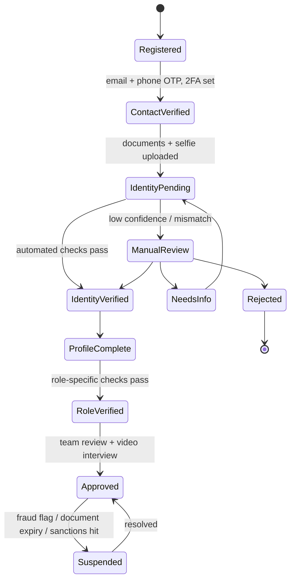

# 2. Sign-up & verification system

Goal: **no anonymous or fake users**. Every founder and investor is a real, verified person (or a verified company with verified owners). We also know them in depth: their background, experience, goals and capacity.

We don't use one long form. Verification is **tiered**. Each tier unlocks more of the platform, so users are never overwhelmed, and sensitive data is collected only once someone is serious.

## 2.1 Verification tiers

| Tier | Name | What it unlocks |
|------|------|-----------------|
| **T0** | Account created | Log in, finish the profile, read public content |
| **T1** | Identity verified | Start drafting a pitch / set up an investor profile |
| **T2** | Profile complete | Submit a pitch / browse blind teasers |
| **T3** | Role verified (financial & business checks) | Pitch goes to screening / investor can request full proposals |
| **T4** | RamiZeeZ approved (manual review + interview) | Live Tank sessions, offers, agreements, investing |

---

## 2.2 Tier 0: Account creation

**Collected:** full legal name, email, mobile number (with country code), password, role(s) wanted, country of residence, and consent to the Terms and Privacy Policy.

**Security controls:**
- Email OTP **and** mobile SMS/WhatsApp OTP verification.
- **Mandatory 2FA**: an authenticator app (TOTP) or a passkey. SMS is only a fallback.
- Strong password rules plus a check against breached-password lists.
- CAPTCHA or bot protection on sign-up and login.
- Disposable and temporary email domains blocked.
- Device fingerprinting and IP reputation checks. Flag VPN/Tor use and many accounts on one device.
- Login alerts for new devices, session management, and automatic lockout after repeated failures.

---

## 2.3 Tier 1: Identity verification (KYC)

### Accepted documents

| Document | Who | Checks |
|----------|-----|--------|
| **CNIC** (front + back) | Pakistani citizens | OCR, CNIC number format (13-digit `XXXXX-XXXXXXX-X`), expiry, match against the **NADRA Verisys** record |
| **NICOP** | Overseas Pakistanis | Same as CNIC |
| **Passport** | Foreign nationals / anyone | MRZ read and checksum validation, expiry, NFC chip read on supported phones |
| **Driving licence / national ID of other countries** | Foreign nationals | Only as a secondary document next to a passport |
| **Company registration** (SECP incorporation certificate, FBR NTN) | Business accounts | Covered in Tier 3 |

### The verification steps
1. **Document capture** with the live camera (gallery uploads not accepted, to stop edited images). Front and back.
2. **Automated document checks**: OCR data extraction, MRZ/barcode validation, tamper and forgery detection (fonts, holograms, photo substitution), expiry check.
3. **Liveness selfie**: an active or passive liveness test (turn head, blink) to stop photos, screens, masks and deepfakes.
4. **Face match** between the selfie and the document photo, with a confidence score.
5. **Government database match**: for CNIC/NICOP, verify through NADRA Verisys (via a licensed KYC provider or direct integration). Name, father/husband name, date of birth and CNIC number must match.
6. **Proof of address**: a utility bill or bank statement no older than 3 months, checked against the declared address.
7. **AML screening**: sanctions lists (UN Security Council, OFAC, EU, UK), Pakistan's proscribed persons lists (the NACTA Fourth Schedule), politically exposed persons (PEP), and adverse media. Re-screened automatically on a schedule.
8. **Duplicate detection**: the same CNIC, passport number, face or device already linked to another account causes an automatic flag.

**Outcome:** a high score means automatic approval. A medium score goes to the manual review queue in the Admin portal. Clear fraud means rejection and a blacklist entry.

> **Recommended approach:** use a specialist KYC provider (for example Shufti Pro, which supports CNIC; or Sumsub, Veriff, or Onfido/Entrust) instead of building document forensics and liveness ourselves. We build the flow, the storage and the review tools around it.

---

## 2.4 Tier 2: Deep personal profile

This is what makes the platform different. We want to know the **person**, not only their ID. It is split into short sections with a progress bar, and most sections are required.

### A. Personal details (everyone)
- Legal name (locked after KYC), preferred name, date of birth, gender (optional), nationality or nationalities
- Father's/husband's name (used for the CNIC match)
- Current and permanent address, city, country
- Marital status and dependants (optional; helps with risk and suitability)
- Languages spoken
- Profile photo (taken from the KYC selfie, cropped)
- Social and professional links: LinkedIn (required for investors, strongly encouraged for founders), website, other public profiles

### B. Education
- Highest qualification, institutions, years, field of study
- Certifications and professional licences
- Uploaded degrees (optional; verified if uploaded)

### C. Professional experience
- Full work history: employer, title, dates, responsibilities, reason for leaving
- Businesses founded or run before: name, sector, years, outcome (running / sold / closed), and **what they learned**
- Industry expertise tags (for example food, tech, textiles, real estate, agriculture)
- Key achievements, awards, media mentions
- CV upload
- **References**: at least 2 professional references (name, relationship, contact). The team may contact them in Tier 4.

### D. Life goals & motivation
Open-text and structured questions, such as:
- What are your 1-year, 5-year and 10-year personal and professional goals?
- Why do you want to be an entrepreneur / investor?
- What problem in society do you care most about solving?
- What does success look like for you?
- How much time can you commit (full time or part time), and what other commitments do you have?
- Your values and working style (short self-assessment)
- How do you handle failure? Describe a setback and what you did.

### E. Legal & integrity declarations
- Any criminal convictions, pending litigation, bankruptcy or loan default (yes/no plus details)
- Any conflict of interest or relationship with RamiZeeZ staff
- PEP self-declaration (a politically exposed person, or related to one)
- A declaration that all information is true, with the legal consequences of false statements
- Consent to background and reference checks

---

## 2.5 Tier 3: Role-specific verification

### Founders (Pitchers)
| Item | Idea stage | Existing business |
|------|-----------|-------------------|
| Founder & co-founder KYC (every co-founder does Tiers 0–2) | ✅ | ✅ |
| Business registration (SECP / sole proprietorship / partnership deed) | Optional | ✅ |
| FBR NTN / tax registration | Optional | ✅ |
| Shareholding / ownership structure | — | ✅ |
| Last 6–12 months of business bank statements | — | ✅ |
| Financial statements (P&L, balance sheet), audited if available | — | ✅ |
| Existing debts, loans and investors (cap table) | — | ✅ |
| Proof of personal commitment (own capital put in, if any) | ✅ | ✅ |
| IP or trademark registrations (if any) | Optional | Optional |

### Investors
| Item | Why |
|------|-----|
| **Investor type**: individual / HNWI / company / fund / family office | Sets the required checks |
| **Investment budget**: total planned for the platform, plus the minimum and maximum ticket per deal | **Controls which pitches they can see** |
| **Source of funds & source of wealth** declaration (salary, business, inheritance, property sale, etc.) | AML requirement |
| **Proof of funds**: recent bank statement or balance certificate, or a wealth statement / tax return (FBR) | Confirms the budget is real. The verified budget caps what they can see. |
| Annual income and net worth band | Suitability and risk |
| Investment experience: previous investments, sectors, exits | Investor profile |
| **Risk appetite questionnaire** | Investors must understand they could lose all their money |
| Sector, stage, city and deal-type preferences, and whether deals must be Shariah-compliant | Matching |
| For companies and funds: registration documents, board resolution, **KYC on every beneficial owner above 10–25% ownership** | AML / beneficial ownership |

**The verified budget matters.** An investor who declares PKR 50M but can prove only PKR 5M is capped at a **verified budget of PKR 5M**. They see only pitches whose minimum ticket fits within that amount.

---

## 2.6 Tier 4: RamiZeeZ approval

- A team member reviews the full profile in the Admin portal, using a checklist.
- A **video KYC interview** (a 15–30 minute call) confirms identity live, discusses goals and checks understanding.
- Reference checks (sampled, or required for large investors and founders).
- A final decision: **Approve / Approve with limits / Needs info / Reject**, with the reason recorded.
- Approved users get a **"RamiZeeZ Verified"** badge and a trust score.

---

## 2.7 Ongoing verification

- **Re-KYC** every 12 months, or earlier when a document expires (the system tracks expiry dates and sends reminders).
- Continuous sanctions and PEP re-screening.
- Changes to legal name, CNIC or bank details trigger re-verification.
- Behaviour monitoring: unusual logins, many unlocked pitches with no investment, or attempts to share contact details inside messages all create flags.
- An account can be suspended at any time. The user is notified and can appeal.

## 2.8 Data we store per user (simplified)

| Entity | Key fields |
|--------|------------|
| `User` | id, email, phone, password hash, 2FA secrets / passkeys, roles, status, tier |
| `IdentityDocument` | user, type, number (**encrypted**), issue/expiry date, country, file references (encrypted storage), verification result, provider reference |
| `LivenessCheck` | user, score, face-match score, provider reference, timestamp |
| `Address` | user, type (current/permanent), lines, city, country, proof document, verified flag |
| `PersonalProfile` | DOB, nationality, languages, marital status, links |
| `Education[]`, `Experience[]`, `PastVenture[]`, `Reference[]` | as described in 2.4 |
| `GoalsProfile` | structured answers + free text |
| `Declaration` | question, answer, details, signed-at, IP |
| `AmlScreening` | lists checked, result, hits, reviewed-by, next-screening date |
| `InvestorProfile` | type, declared budget, **verified budget**, ticket min/max, preferences, risk score |
| `FounderProfile` | stage, co-founders, business entity link |
| `VerificationCase` | user, tier, status, assigned reviewer, checklist, notes, decision, timestamps |
| `AuditLog` | every view, change and decision on the data above |

## 2.9 Privacy & protection of this data

This is very sensitive personal and financial data, so:
- CNIC and passport numbers and financial figures are encrypted at field level. Document images sit in encrypted storage with short-lived access links.
- Team members see only what their role needs. For example, marketing staff never see CNIC images.
- Every access to a KYC document is logged (who, when, why).
- Data is kept only as long as the law requires, then deleted.
- Users can download their data and ask for account closure. AML records are kept for the legally required period.
